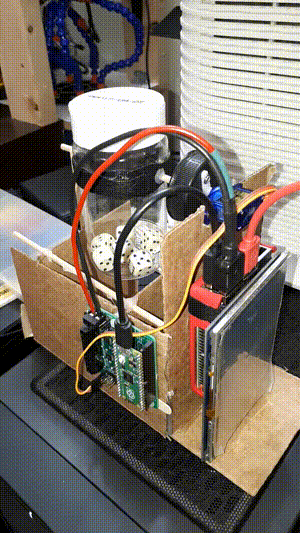
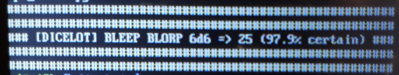
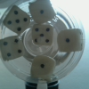
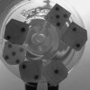

# Dicelot the Dicebot

## Cardboard-based random number generator

This project shakes dice with a servo motor and then takes a photo to count the dice for you.

The ML part uses synthetic data with augmentation to get extra mileage out of a small training set (27 photos -> 59,308 photos). The model is right roughly 80% of the time on the test set (125 photos; annoying to label!). When it's wrong it's usually by 1.

## Workflow

There's a bit of data collection to get started, but 

  * Data preparation
    * Take 125 photos of dice, label them by their total 6d6 value, and then keep these as your test set (so that you know how well the robot does with real photos).
    * Prepare your fake data
      * Take 18 images of the botle without dice to act as a background.
      * Take 7 images with dice, cut out each die separately, and organize them all by value.
      * Run the `generate_images.py` script to generate nearly 60,000 permutations of dice photos
  * Run the model: `ml.py` trains a generic convolution neural network on the fake data, while rotating and flipping photos to push the data a little bit further.
  * Use `convert.py` to transform the final model into a light `tflite` version so that it runs on the Raspberry Pi.
  * Use the bot!
    * Run `ShakeDice.py` to shake some dice!
    * Use `raspistill` to take a new photo!
    * Run `pi_infer.py` to evaluate the model on the new photo!

## Hardware

This is all made with Raspberry Pi and Python There's a Raspberry Pi 2B with `tflite` to run `tensorflow` models and a Raspberry Pi Pico running circuitpython to control the servo motor.

The chassis (if you can call it that) is a cut-up cardboard box, some wooden sticks, and some hot glue. It's all surprisingly rigid.

## Data Generation

This is what real dice look like. It's a 100x100 jpg converted to grayscale when read by Python.

Pillow takes some photos of the empty bottle and pastes on top some cut-outs of dice. By changing the position and value of the dice, a lot of fake data can be made.

This is what a fake image looks like.

## Neat things

Some things I enjoyed

  * The Raspberry Pi Pico runs Python! It was my first time using it, and it was fun.
  * [TF Lite ](https://www.tensorflow.org/lite) runs ML models on smaller devices like mobile and Raspberry Pis. As a bonus it cut down my model's size by 80%.
  * Hot glue is great! Not sure how I got by without it before. Definitely the king of glues!

